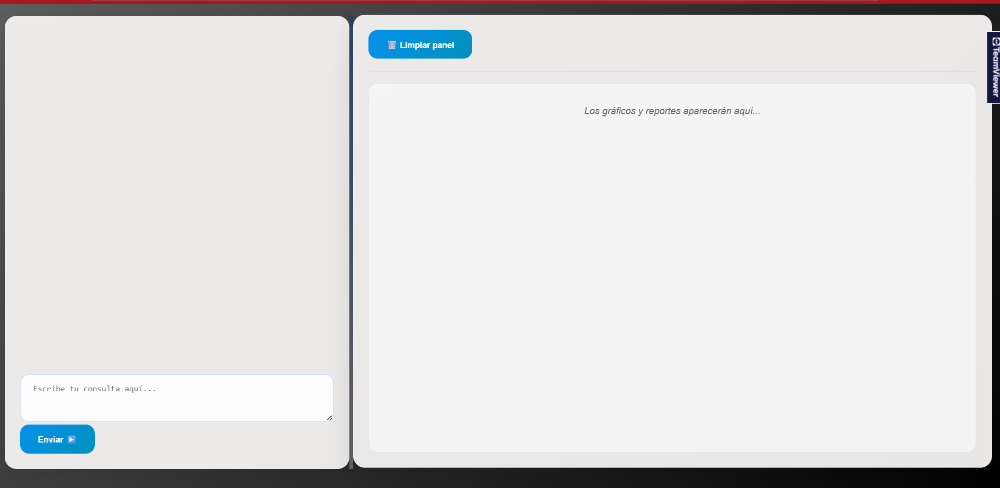
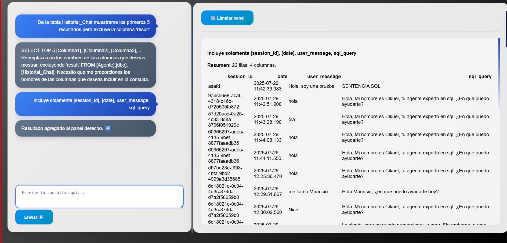

# Agente SLQ 
Transforma las sentencias de lenguaje natural a sentencias de SQL, las executa y pinta los resultados en pantalla.

## **Uso** 

### Entorno virtual 

#### Opcion 1. Usar UV 
Con uv run api/main.py arrancara la api, y creara el entorno virtual con las dependencias dadas. 

```bash 
pip install uv 
uv run api/main.py 
```

#### Opcion 2. Usar pip 

```bash
python -m venv .venv 
# Windows
.\.venv\scripts\activate

# Mac
./.venv/bin/activate 

pip install -r requirements.txt 
```

#### Crear la tabla para el historial del chat
```sql
CREATE TABLE Historial_Chat(
	[session_id] int,
	[date] DATETIME DEFAULT GETDATE(), 
	user_message varchar(255),
	sql_query varchar(255), 
	result varchar (255)
);
```

### Crear el archivo .env 
Debe seguir la siguiente forma 

```
# SQL 
SERVER_SQL=
DATABASE=
USER=
PASSWORD=

# Azure
AZURE_OPENAI_ENDPOINT=
AZURE_OPENAI_API_KEY=
AZURE_OPENAI_API_VERSION=
AZURE_OPENAI_RESOURCE_NAME=
AZURE_OPENAI_DEPLOYMENT_NAME=
```

#### Levantar API 
```bash 
uvicorn api.main:app --reload
```


#### Muestra de como se visualiza el historial






